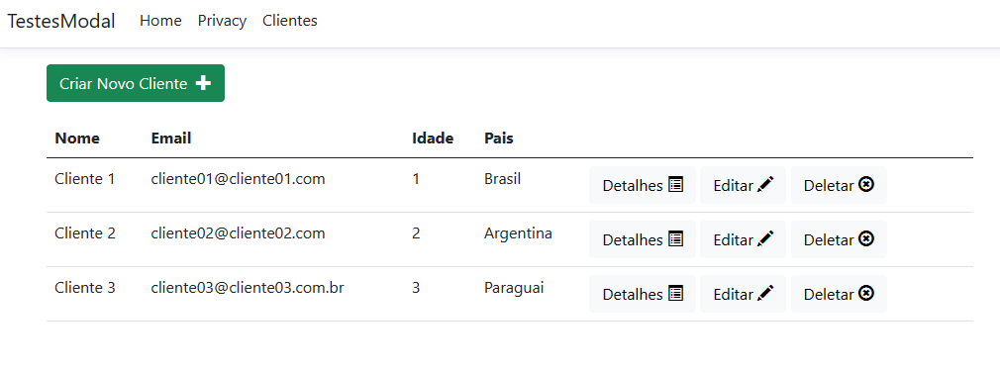
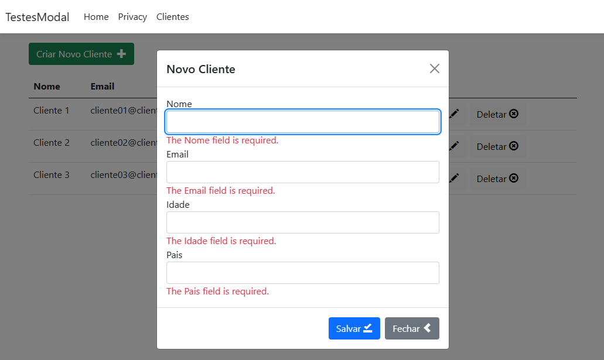

# aspnet-mvc-bootstrap-modal
This CRUD example aims to show how to create an ASP NET MVC application and integrate with Bootstrap's Modal component.

This application uses: 
- Dotnet 7 with ASP NET MVC
- Entity Framework Core 7
- Bootstrap 5.1
- JQuery 3.6
- JQuery Validate
- JQuery Validate Unobtrusive

